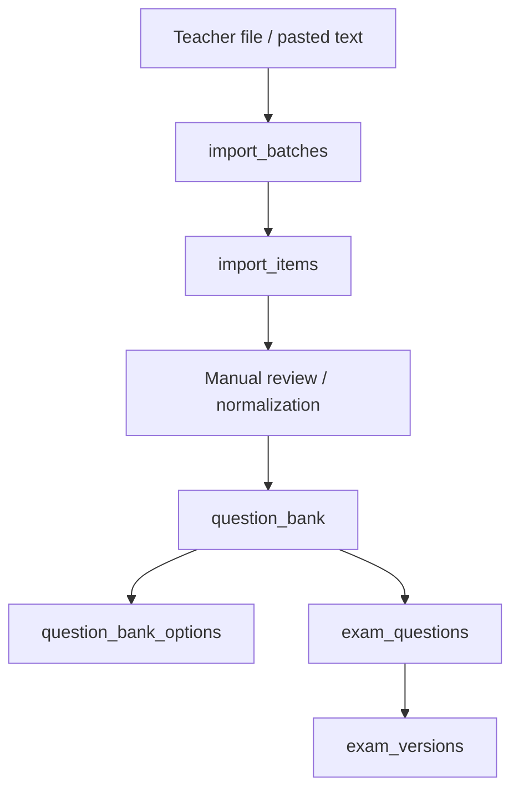
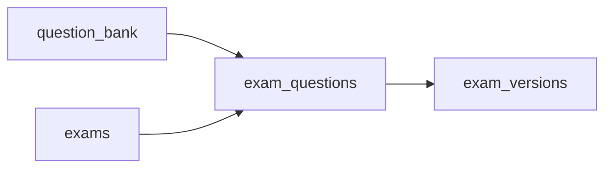

# Domain: Question Bank and Exam Assembly

This document explains how raw teaching material becomes durable question assets and then becomes an exam.

---

## 1. Purpose

The question bank is the durable knowledge layer of the system.

It must support:
- reuse across many exams
- import from inconsistent teacher files
- filtering by topic, difficulty, or status later
- safe versioning when exams are already published

---

## 2. Data path

---

## 3. Why questions do not belong directly to exams

If a question belongs only to one exam, the system becomes exam-centric and future growth becomes expensive.

By keeping `question_bank` as the source layer:
- the same question can appear in many exams
- import is separated from delivery
- stats can later be attached to bank items
- a teacher can build variants without duplicating raw text too early

---

## 4. Assembly rule

Interpretation:
- `question_bank` holds source questions.
- `exam_questions` says which bank questions are included in an exam.
- `exam_versions` freezes a publishable snapshot.

---

## 5. Design warning

Do not overload `question_bank` with runtime fields such as:
- current student answer count
- current attempt order
- active exam timer state

Those belong elsewhere.

---

## 6. Expected future extensions

- tags / topics / subjects
- difficulty levels
- media attachments
- imported document confidence scores
- AI-assisted parse suggestions
- item statistics such as discrimination or difficulty index

