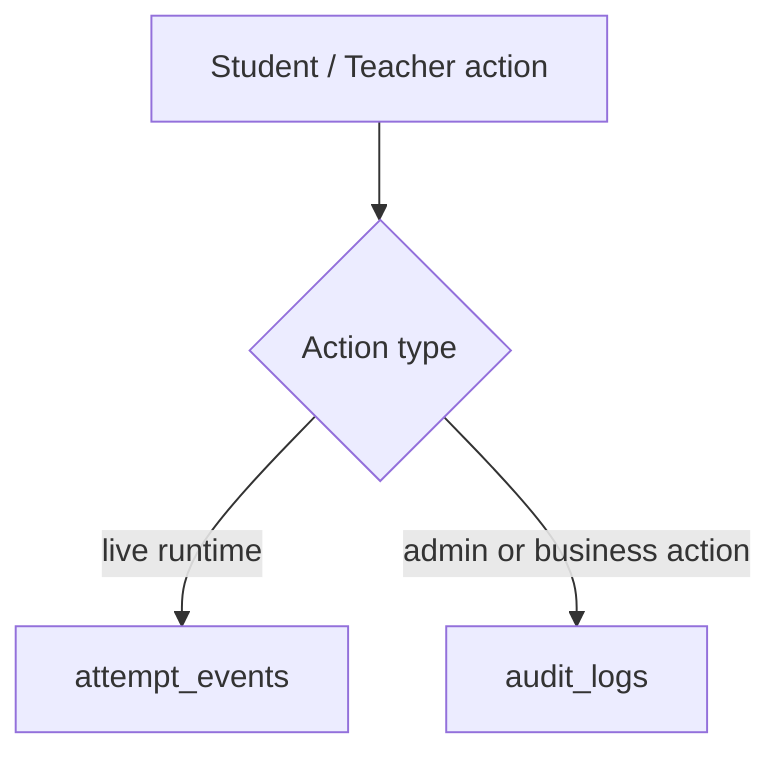
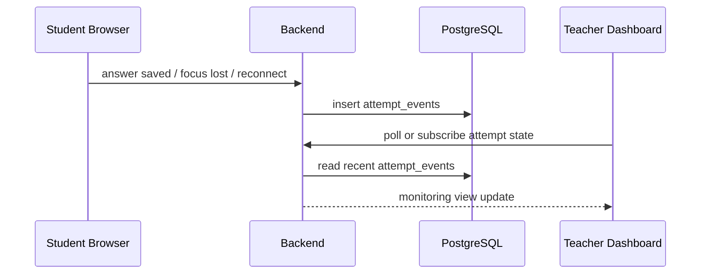

# Domain: Monitoring and Audit

This document explains the difference between operational monitoring and business audit history.

---

## 1. Monitoring vs audit

### Monitoring
Operational event stream tied to live exam behavior.
Examples:
- answer_saved
- reconnect
- tab_hidden
- heartbeat_missed
- timeout

### Audit
Business or administrative actions with accountability.
Examples:
- teacher created exam
- teacher edited question
- exam published
- account locked
- student manually submitted

These should not be merged into one generic table without discipline.

---

## 2. Event map

---

## 3. Monitoring sequence

---

## 4. Why append-only matters

Events are evidence. If they are overwritten instead of appended, the system loses:
- dispute resolution capability
- operational debugging signal
- teacher trust in monitoring history

So the bias should be toward append-only logs with timestamps.

---

## 5. Runtime state vs event history

Some fields are current state, not audit history:

- `exam_attempts.current_question_order`: where the student was when they last saved or moved.
- `exam_attempts.last_saved_at`: latest successful answer/progress save.
- `exam_attempts.client_last_seen_at`: latest heartbeat or reconnect signal.

These fields are allowed to update in place because the UI needs fast resume and live-room status. The evidence trail still belongs in `attempt_events`.

---

## 6. Future additions

- session heartbeat tracking
- IP / device anomaly signals
- admin review notes
- cheating suspicion score
- dashboard aggregates and timelines
