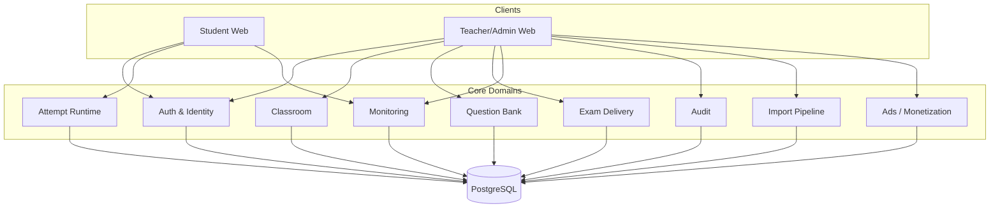
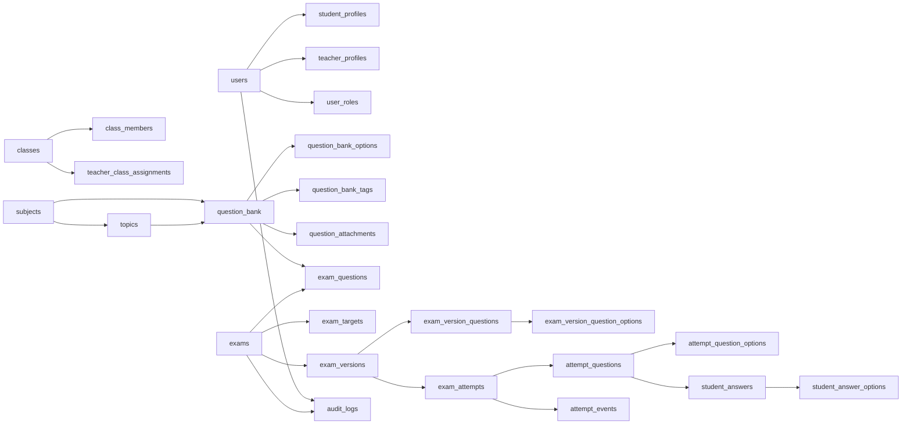
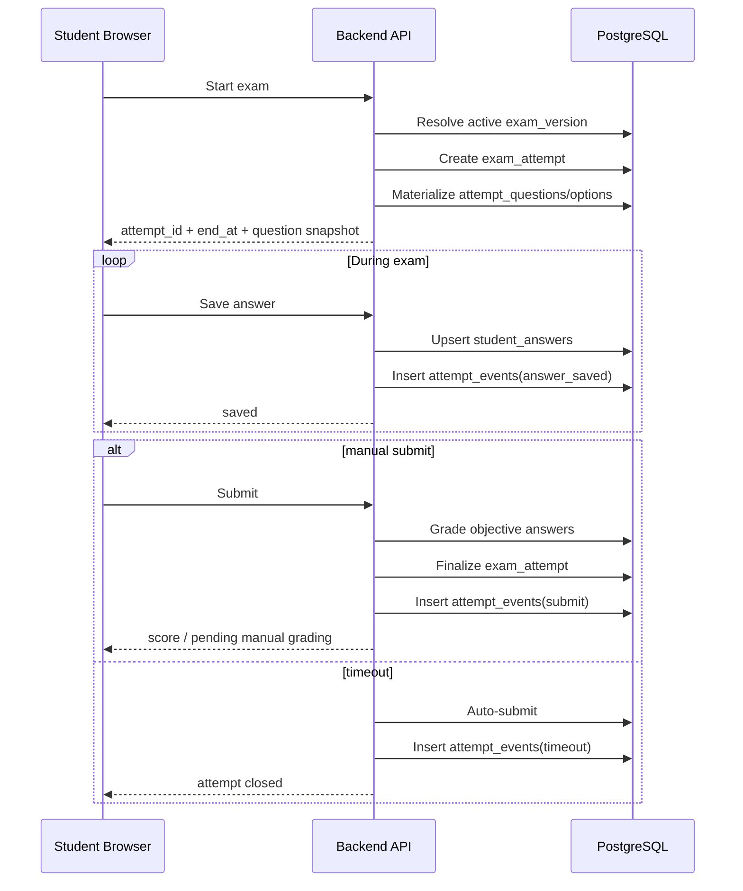

# Web Exam System Overview

This is the master architecture view for the web exam platform. It is intentionally high-level. Use it as the top-level map, then drill into the domain-specific files for the details.

---

## 1. Core architectural principle

The system is split into four data layers:

1. **Core assets** — durable domain entities such as users, classes, and question bank items.
2. **Delivery/configuration** — how exams are assembled, targeted, and published.
3. **Runtime state** — attempts, answers, and timing state created while students are taking exams.
4. **History/audit** — immutable or append-oriented records that preserve what happened.

This separation prevents future features from rewriting old truth.

---

## 2. Bounded contexts

---

## 3. High-level domain map

---

## 4. Runtime truth flow

---

## 5. Non-negotiable rules

1. **Questions belong to the question bank, not directly to exams as the source of truth.**
2. **Published exams must be versioned.** A teacher edit after publication creates a new version or cloned exam.
3. **Each attempt owns its exact student-facing snapshot.** This preserves question order, option order, and grading truth.
4. **Timer truth comes from `exam_attempts.end_at`, not the browser.**
5. **Audit and monitoring data are append-oriented.** They must explain what happened, not only the final state.
6. **Exam type and runtime status are separate.** `exam_mode` answers “Thi thử hay chính thức”; `exam_status` answers “draft/scheduled/open/closed”.
7. **Teacher data scope comes from explicit class assignment.** `teacher_class_assignments` lets multiple teachers manage or view the same class without abusing homeroom teacher fields.

---

## 6. Future growth points

The current design should allow additive growth in these areas without a full rewrite:

- multiple schools / multi-tenant support
- more question types
- richer anti-cheat monitoring
- import from messy teacher documents
- analytics dashboards
- ad placement outside the exam runtime path
- AI-assisted parsing or grading in isolated modules

---

## 7. Companion documents

- `domain_question_bank.md`
- `domain_monitoring_audit.md`
- `database_decision.md`
- `exam_import_ai_pipeline.md`
- `frontend_data_mapping.md`
- `web_exam_schema (1).dbml`
